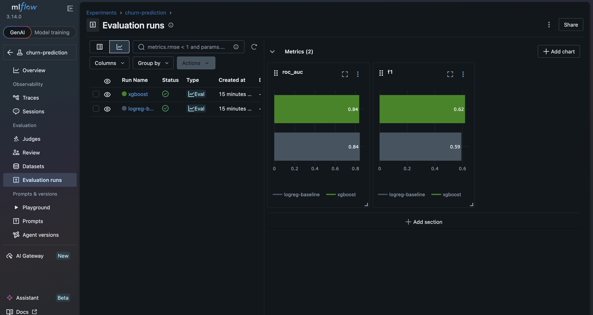

# End-to-End Churn Prediction Pipeline

Production-style ML pipeline: data ingestion → feature engineering → XGBoost training (tracked with MLflow) → containerized FastAPI serving → CI/CD with GitHub Actions.

## Architecture
```
data/raw → src/data.py → src/features.py → src/train.py (MLflow) → models/model.json → src/api.py (FastAPI, Docker)
```

## Dataset
[Telco Customer Churn (Kaggle)](https://www.kaggle.com/datasets/blastchar/telco-customer-churn). Download `WA_Fn-UseC_-Telco-Customer-Churn.csv` into `data/raw/`.

## Quickstart
```bash
pip install -r requirements.txt
python src/data.py          # clean + split
python src/features.py      # build feature matrix
python src/train.py         # train + log to MLflow
uvicorn src.api:app --reload  # serve predictions
```

## Docker
```bash
docker build -t churn-api .
docker run -p 8000:8000 churn-api
```

## Results

| Model | ROC-AUC | F1 |
|---|---|---|
| Logistic Regression (baseline) | 0.843 | 0.592 |
| XGBoost (class-weighted) | 0.837 | 0.619 |



The honest headline: the linear baseline slightly *wins* on ROC-AUC —
churn drivers in this dataset (contract type, tenure, monthly charges)
are largely linear, and 5.6k rows isn't enough for tree ensembles to
find interactions worth their variance. XGBoost wins F1 at the 0.5
threshold because `scale_pos_weight` compensates for the 26.5% class
imbalance, catching more actual churners. Model choice therefore depends
on use: ranking customers for a retention budget → either model;
flagging churners at a fixed threshold → XGBoost.

## Tests & CI
`pytest tests/` runs locally; GitHub Actions runs lint + tests on every push.
